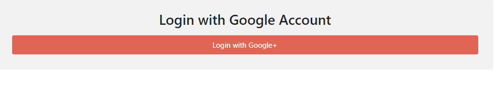
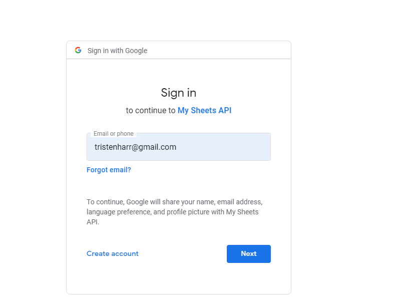
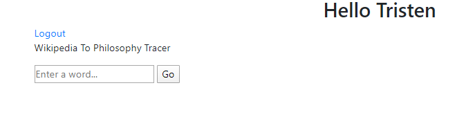
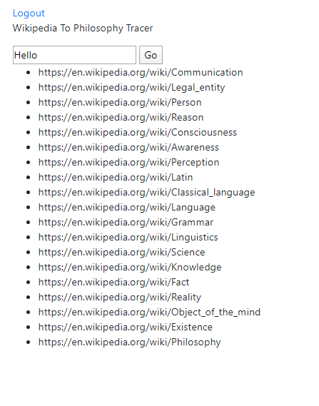

# Final Project Version

This project uses a custom-wrapped version of flask-login with oauth2
to allow SSO access.

The flask implementation used is a custom version that I use for all of my projects.
This flask wrapper allows plug-n-play modules to be built for any website.
It works by utilizing a CustomViewClass which allows specific portions of
a website to be bundled together into a view-container. 

CustomViewClass.py
```python
class CustomView(object):

    def __init__(self):
        self.rules = []

    def register_view(self, app):
        for r in self.rules:
            app.add_url_rule(**r)
```

This entire application is designed with a single CustomView container.
In order to implement the SSO, a custom SSO-wrapper was written and it is
contained in the FlaskState.py file, which holds an SSO state and performs all
basic SSO functions. 

The project utilizes modern libraries including bootstrap, jquery, and jinja2.

This project also uses AJAX, and a form of Reverse-AJAX for asychronous page loading
and asychronous event-streaming to the page.

The AJAX calls are just simple implementations such as:

```javascript
function do_search() {
    var word = $("#word").val();
    var json_data = {"data": word};
    $.ajax({
        url: "/word_go",
        type: "POST",
        datatype: "json",
        data: JSON.stringify(json_data),
        contentType: "application/json; charset=utf-8",
        success: function(response){
            response = JSON.parse(response);
            if (response.success){

            } else {
                alert("FAIL");
            }
        },
        error: function (error) {
            alert("ERROR");
        }
    })
}
```

The above is used in conjunction with the Requests library, and BeautifulSoup4
to allow the user to enter a word, and then a web-crawler is built and run in the
background. That web-crawler crawls through wikipedia links and jumps from
page to page until it finally ends on the philosophy page. It is said that 96% of
all pages will eventually lead to the Philosophy page in wikipedia by just clicking links.

These links are then sent back to the page by creating an EventStream object as
follows:

```javascript
var log_source = new EventSource("/link_send");
log_source.onmessage = function (event) {
    $("#my_links").append(event.data);
};
```

```python
    def word_go(self):
        response = request.get_json()
        self.trace_go(response["data"])
        json_response = {"success": True}
        return json.dumps(json_response)

    def trace_go(self, word):
        link = {"link": f"https://en.wikipedia.org/wiki/{word}",
                "found": False}
        latest_link = link["link"]
        link_q.put(latest_link)
        while not link["found"]:
            link = trace(**link)
            latest_link = link["follows"][-1]
            link_q.put(latest_link)

    def link_send(self):
        def send_stream(ctx):
            while True:
                yield "data: {}\n\n".format(ctx.get_send_message())
        return Response(send_stream(self), mimetype="text/event-stream")

    def get_send_message(self):
        while link_q.empty():
            time.sleep(0.5)
        l = link_q.get()
        return f"<li>{l}</li>"
```

The login page:



Redirect to google login:



Landing Page After Login:



Tracing Route To Philosophy:

